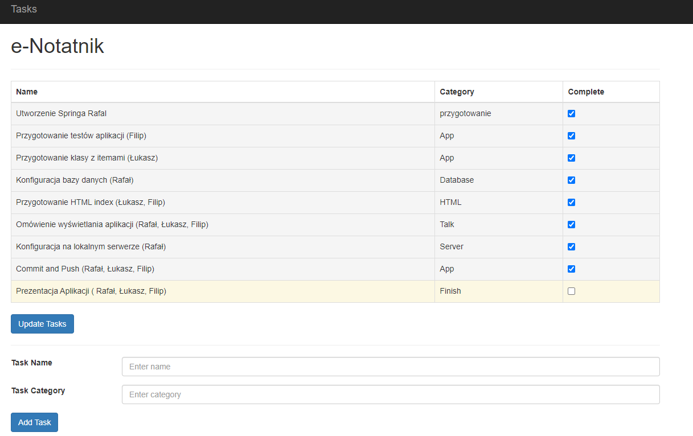
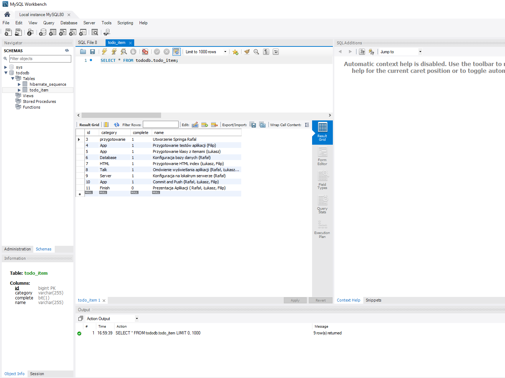

# What:
e- Notatnik prosta aplikacja z zapisaem listy rzeczy i czynności do wykoania.
# Why:
Aplikacja ma być stworzona w celu ułatweinia planowania pracy oraz oragnizacji zadań
# How:
Aplikacja wykorzystująca Spring Boot z następującymi opcjami, Spring JPA i MySQL dla trwałości danych Szablon Thymeleaf do renderowania, stworzona na localnym serwerze tomcat

# Run APP
APP

TOMCAT

MySql

wyk. Rafał Krasoń, Łukasz Maślaczyk, Filip Jakubowski.
