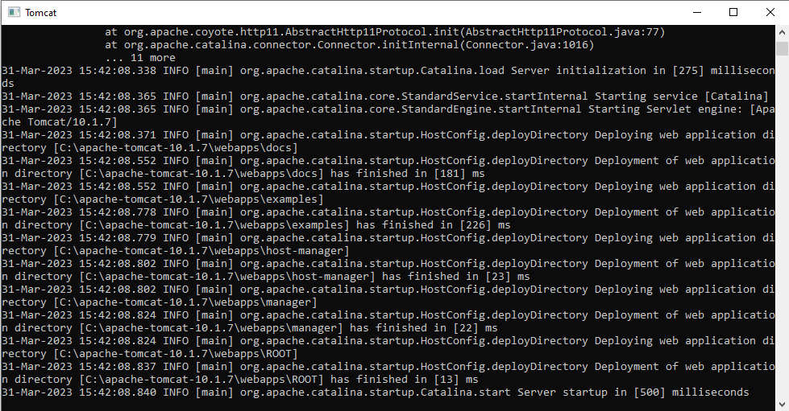

# What:
e- Notatnik prosta aplikacja z zapisaem listy rzeczy i czynności do wykoania.
# Why:
Aplikacja ma być stworzona w celu ułatweinia planowania pracy oraz oragnizacji zadań
# How:
Aplikacja wykorzystująca Spring Boot z następującymi opcjami, Spring JPA i MySQL dla trwałości danych Szablon Thymeleaf do renderowania, stworzona na localnym serwerze tomcat
# Configure MySQL
Utwórz bazę danych w swojej instancji MySQL. Zaktualizuj plik application.properties w folderze src/main/resources, podając adres URL, nazwę użytkownika i hasło do Twojej instancji MySQL. Schemat tabeli dla obiektów Todo zostanie utworzony dla Ciebie w bazie danych.

# Run APP
Aby urchuchomić aplikację, potrzebne będzie nam środowisko np Inteliji, serwer Tomcat, oraz wspomniana wyżej baza danych. Najpierw konfigurujemy bazę danych, poczym uruchamiamy ToDoAplication, a następnie serwer tomcat. Przechodzimy do przeglądarki i wpisujemy http://localhost:8080/ gdzie pojawia nam się aplikacja e-notatnik.Podczas dodawania i aktualizowania zadań w aplikacji możesz weryfikować zmiany w bazie danych za pomocą konsoli MySQL, używając prostych instrukcji, takich jak select * from todo_item.

APP

TOMCAT

MySql

link demo https://youtu.be/Y7Rgi7czLq8
wyk. Rafał Krasoń, Łukasz Maślaczyk, Filip Jakubowski.
